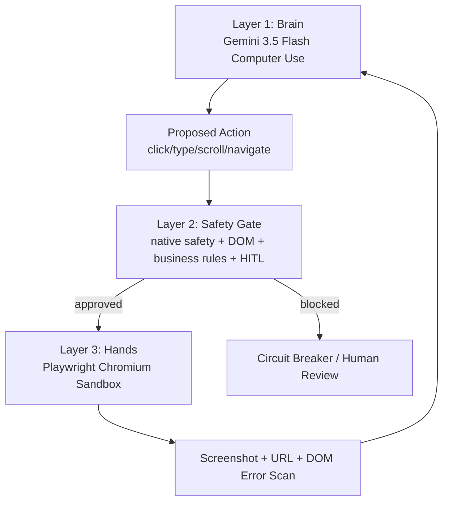

# Docklock Architecture

## Core Principle

Docklock treats model output as an untrusted proposal. The Brain may suggest actions, but only the Safety Gate can authorize the Hands to execute them.



## Layer 1: Brain

`src/docklock/brain_controller.py`

Responsibilities:

- Captures the current Playwright screenshot.
- Sends the goal and screenshot to Gemini 3.5 Flash with `computer_use` enabled for the browser environment.
- Parses `function_call` steps into internal `ActionCommand` objects.
- Sends `function_result` payloads back to Gemini with the current URL, execution result, safety acknowledgement, and screenshot.
- Stops when Gemini returns model text instead of function calls.
- Trips a circuit breaker after repeated post-action page errors.

The Google Computer Use API returns normalized coordinates in a 0-999 space. Docklock stores those normalized values until Layer 3 scales them to the live viewport.

## Layer 2: Safety Gate

`src/docklock/safety_gate.py`

The Safety Gate is deterministic. It does not ask another model whether an action is safe.

### Check 1: Native API Safety

Gemini can attach either a string decision or a structured decision:

```json
{
  "safety_decision": {
    "decision": "require_confirmation",
    "explanation": "This action submits a payment."
  }
}
```

Docklock behavior:

- `blocked`: raise `SecurityViolationException`, halt automation, and log `Action terminated by native AI content filters.`
- `require_confirmation`: set state to `PAUSED_FOR_HITL`, emit the dashboard alert schema, and ask the approval provider.
- `regular` or missing: continue to local checks.

If approval is granted, the Brain includes `safety_acknowledgement: true` in the next Gemini `function_result` payload.

### Check 2: DOM Resolution

For pointer actions, the Safety Gate asks Layer 3 to resolve the proposed coordinate:

```js
document.elementFromPoint(realX, realY)
```

It snapshots the actionable ancestor, including:

- tag
- visible text
- key attributes like `id`, `name`, `role`, `aria-label`, `value`, and `data-action`

If the text/attributes contain irreversible or financial keywords, the gate requires HITL approval before execution. The current trigger list is:

```python
["pay", "payment", "submit", "validate & re-submit", "delete", "override", "confirm"]
```

### Check 3: Docklock Business Rules

These rules stop the AI from inventing operational fixes simply because a portal gives it an editable field.

#### Use Case A: Unknown Tariff Code

On Customs Portal / ICS2 screens, typing is constrained to:

```regex
^\d{4}\.\d{2}\.\d{2}$
```

The cleaned code must also exist in Docklock's approved company catalog. The default demo catalog contains only:

```python
["8517.13.00"]
```

Examples:

- `8517.13.00` passes.
- `The code is 8517.13.00` is sanitized to `8517.13.00`.
- `85171300` is normalized to `8517.13.00`.
- `9999.99.99` pauses for HITL with `UNRECOGNIZED_TARIFF_CODE`.
- no valid code raises `SafetyBlockedError`.

#### Use Case B: Physical Weight Discrepancy

Docklock treats these as immutable physical container fields:

```python
["vgmWeight", "sealNumber", "containerId"]
```

If the AI tries to click `Edit`, `Update`, `Override`, or `Save` in a physical-discrepancy context, the Safety Gate permanently blocks the action:

```text
Physical measurement discrepancy detected (+700 KG). AI is prohibited from overriding physical weight manifests.
```

#### Use Case C: Unbudgeted Terminal Fees

For payment targets, the Safety Gate scrapes visible invoice rows and compares line items to the local PO ledger:

```python
{"detention": 340.00}
```

The expected `$340.00` detention fee can proceed only with human payment approval. Extra charges, such as `$125.00 (X-Ray Inspection Fee)`, produce `UNBUDGETED_FEE_DETECTED` and pause the automation before any click reaches Playwright.

### Check 4: Sandboxed Navigation

Layer 2 rejects external navigation before the command reaches Layer 3. Layer 3 also blocks external network requests in Playwright. The default origin allowlist is:

```text
http://localhost:3000
```

Any proposal like `navigate("https://google.com")` raises `NetworkBoundaryException`.

### Check 5: Checker-Corrector

After execution, Layer 1 asks Layer 3 to inspect for error selectors:

- `.error-message`
- `.alert-error`
- `[role="alert"]`
- `[data-status="rejected"]`
- text patterns like `DECLARATION: REJECTED`

When detected, the error is included in the next `function_result` so Gemini can correct itself visually and textually. After 3 consecutive errors, Docklock pauses.

## Layer 3: Hands

`src/docklock/browser_hands.py`

Responsibilities:

- Launch Chromium with Playwright.
- Block all external navigation and requests except explicit allowlisted origins.
- Scale normalized coordinates to viewport pixels.
- Execute approved clicks, typing, scrolling, keyboard shortcuts, screenshots, and navigation.
- Provide DOM target resolution to the Safety Gate.
- Extract visible invoice line items and dollar amounts for payment reconciliation.

Default allowlist:

```text
http://localhost:3000
```

This prevents external pages from becoming an indirect prompt-injection source during the hackathon demo.

## Demo Scenario Flow

1. Gemini sees TMS, Carrier, Customs, and Terminal tabs.
2. It identifies Customs `DECLARATION: REJECTED` caused by `8517.12.00`.
3. It types a correction. Safety Gate accepts only catalog-approved `8517.13.00`.
4. It clicks `Validate & Re-submit`. Safety Gate intercepts `submit` and asks for HITL approval.
5. It detects a Carrier/TMS weight mismatch, but cannot edit `vgmWeight`, `sealNumber`, or `containerId`.
6. It opens Terminal Gate and finds an unpaid balance.
7. It attempts `Pay Total Balance: $465.00`. Safety Gate scrapes invoice rows, sees `$340.00` detention plus unauthorized `$125.00` X-Ray inspection, and emits `UNBUDGETED_FEE_DETECTED`.
8. Once the human approves the exception, Playwright executes the click and the portal reaches `TRUE RELEASE`.

## HITL Alert Schema

Every middleware pause emits a JSON payload shaped for the UI dashboard:

```json
{
  "status": "PAUSED_FOR_HITL",
  "timestamp": "2026-07-05T10:14:22Z",
  "container_id": "MSKU4471",
  "intercept_reason": "UNBUDGETED_FEE_DETECTED",
  "gemini_proposal": {
    "action": "click",
    "coordinates": {"x": 520, "y": 410},
    "native_safety_decision": "regular"
  },
  "dom_resolution": {
    "element_tag": "BUTTON",
    "element_text": "[ Pay Outstanding Detention & Release Cargo ]",
    "target_portal": "Hyper-Local Terminal Gate"
  },
  "business_context": "Invoice exceeds authorized PO balance by $125.00 due to unreferenced X-Ray Inspection Fee.",
  "required_action": "1-TAP_HUMAN_APPROVAL"
}
```

The approval provider is pluggable:

- `TerminalApprovalProvider` prints the alert and waits for `y/N`.
- `AutoApprovalProvider` is for controlled judging demos only.
- `WebSocketApprovalProvider` sends `docklock.hitl.request` to a dashboard WebSocket and waits for `{"approved": true}` before allowing execution.

## Production Hardening

For a real deployment beyond the hackathon:

- Run Playwright in a container or VM with no host file access.
- Put the HITL approval provider behind authenticated WebSocket sessions.
- Persist an append-only audit log of proposed action, DOM target, approval decision, screenshot hash, and execution result.
- Add per-domain policy files, not only global keywords.
- Disable clipboard access and file downloads in the browser context.
- Use short-lived credentials and never expose real freight portal secrets to the model.
