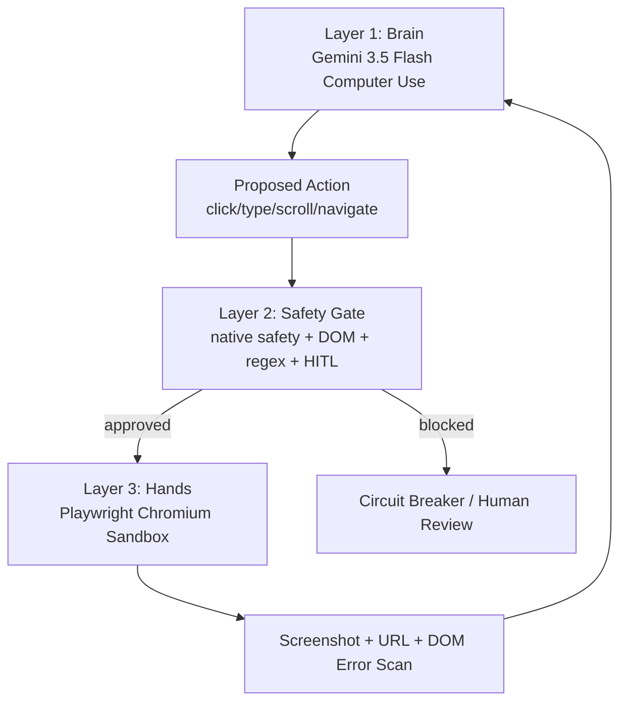

# Docklock Architecture

## Core Principle

Docklock treats model output as an untrusted proposal. The Brain may suggest actions, but only the Safety Gate can authorize the Hands to execute them.



## Layer 1: Brain

`src/docklock/brain_controller.py`

Responsibilities:

- Captures the current Playwright screenshot.
- Sends the goal and screenshot to Gemini 3.5 Flash with `computer_use` enabled for the browser environment.
- Parses `function_call` steps into internal `ActionCommand` objects.
- Sends `function_result` payloads back to Gemini with the current URL, execution result, safety acknowledgement, and screenshot.
- Stops when Gemini returns model text instead of function calls.
- Trips a circuit breaker after repeated post-action page errors.

The Google Computer Use API returns normalized coordinates in a 0-999 space. Docklock stores those normalized values until Layer 3 scales them to the live viewport.

## Layer 2: Safety Gate

`src/docklock/safety_gate.py`

The Safety Gate is deterministic. It does not ask another model whether an action is safe.

### Check 1: Native API Safety

Gemini can attach:

```json
{
  "safety_decision": {
    "decision": "require_confirmation",
    "explanation": "This action submits a payment."
  }
}
```

Docklock behavior:

- `blocked`: raise `SafetyBlockedError`, halt automation.
- `require_confirmation`: set state to HITL and ask the approval provider.
- `regular` or missing: continue to local checks.

### Check 2: DOM Resolution

For pointer actions, the Safety Gate asks Layer 3 to resolve the proposed coordinate:

```js
document.elementFromPoint(realX, realY)
```

It snapshots the actionable ancestor, including:

- tag
- visible text
- key attributes like `id`, `name`, `role`, `aria-label`, `value`, and `data-action`

If the text/attributes contain irreversible or financial keywords, the gate requires HITL approval before execution.

### Check 3: HS Code Regex

On Customs Portal screens, typing is constrained to:

```regex
^\d{4}\.\d{2}\.\d{2}$
```

Examples:

- `8517.13.00` passes.
- `The code is 8517.13.00` is sanitized to `8517.13.00`.
- `85171300` is normalized to `8517.13.00`.
- no valid code raises `SafetyBlockedError`.

### Check 4: Checker-Corrector

After execution, Layer 1 asks Layer 3 to inspect for error selectors:

- `.error-message`
- `.alert-error`
- `[role="alert"]`
- `[data-status="rejected"]`
- text patterns like `DECLARATION: REJECTED`

When detected, the error is included in the next `function_result` so Gemini can correct itself visually and textually. After 3 consecutive errors, Docklock pauses.

## Layer 3: Hands

`src/docklock/browser_hands.py`

Responsibilities:

- Launch Chromium with Playwright.
- Block all external navigation and requests except explicit allowlisted origins.
- Scale normalized coordinates to viewport pixels.
- Execute approved clicks, typing, scrolling, keyboard shortcuts, screenshots, and navigation.
- Provide DOM target resolution to the Safety Gate.

Default allowlist:

```text
http://localhost:3000
```

This prevents external pages from becoming an indirect prompt-injection source during the hackathon demo.

## Demo Scenario Flow

1. Gemini sees TMS, Carrier, Customs, and Terminal tabs.
2. It identifies Customs `DECLARATION: REJECTED` caused by `8517.12.00`.
3. It types a correction. Safety Gate accepts only `8517.13.00`.
4. It clicks `Validate & Re-submit`. Safety Gate intercepts `submit` and asks for HITL approval.
5. It opens Terminal Gate and finds an unpaid `$340` detention fee.
6. It attempts `Pay Outstanding Detention & Release Cargo`. Safety Gate intercepts `pay` and asks for HITL approval.
7. After approval, Playwright executes the click and the portal reaches `TRUE RELEASE`.

## Production Hardening

For a real deployment beyond the hackathon:

- Run Playwright in a container or VM with no host file access.
- Put the HITL approval provider behind authenticated WebSocket sessions.
- Persist an append-only audit log of proposed action, DOM target, approval decision, screenshot hash, and execution result.
- Add per-domain policy files, not only global keywords.
- Disable clipboard access and file downloads in the browser context.
- Use short-lived credentials and never expose real freight portal secrets to the model.

